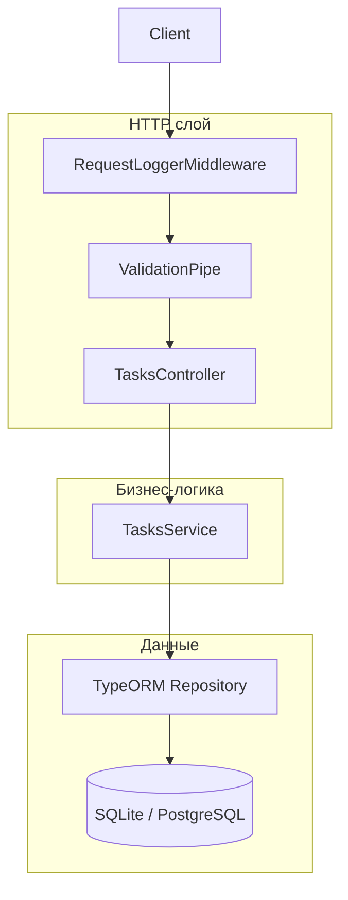

# Руководство по проекту NestJS Task API

Документ для обсуждения с техлидом: что сделано, как устроено, почему выбраны те или иные решения.

---

## 1. Кратко о проекте (30 секунд)

**NestJS Task API** — REST-сервис для CRUD-операций над задачами (список, создание, обновление, удаление, смена статуса).

- **Стек:** NestJS 11, TypeScript, TypeORM, SQLite (локально) / PostgreSQL (Docker).
- **ТЗ:** тестовое задание — REST API с валидацией, пагинацией, Docker, unit-тестами.
- **Сверх ТЗ:** e2e-тесты, ESLint/Prettier, CI (GitHub Actions), Swagger (`/api`), middleware логирования.

Запуск для демо:

```bash
npm install
npm run start:dev    # http://localhost:3000
# Swagger: http://localhost:3000/api
npm test             # unit + e2e
```

---

## 2. Архитектура (что сказать лиду)

### Слои приложения



**Принцип:** тонкий контроллер, логика в сервисе, доступ к БД через TypeORM Repository. Без лишних абстракций (CQRS, отдельный Repository-класс) — для объёма ТЗ это оправдано.

### Поток одного запроса (пример `POST /tasks`)

1. **Middleware** (`RequestLoggerMiddleware`) — фиксирует время старта, после ответа пишет в console: метод, URL, статус, длительность.
2. **ValidationPipe** (глобально в `main.ts`) — превращает JSON в `CreateTaskDto`, проверяет декораторы `class-validator`, отсекает лишние поля.
3. **TasksController** — принимает DTO, вызывает `TasksService.create()`.
4. **TasksService** — `repository.create()` + `repository.save()`.
5. **TypeORM** — INSERT в таблицу `tasks`, возврат сущности с `id`, `createdAt`, `updatedAt`.

---

## 3. Структура репозитория

```
nestjs-task-api/
├── src/                          # Исходный код приложения
│   ├── main.ts                   # Точка входа: NestFactory, pipes, Swagger
│   ├── app.module.ts             # Корневой модуль: БД, middleware, импорт TasksModule
│   ├── app.controller.ts         # GET / — подсказка по эндпоинтам
│   ├── database.config.ts        # Конфиг TypeORM (sqlite | postgres по env)
│   ├── common/
│   │   └── middleware/
│   │       └── request-logger.middleware.ts
│   └── tasks/                    # Feature-модуль «Задачи»
│       ├── tasks.module.ts
│       ├── tasks.controller.ts   # REST /tasks
│       ├── tasks.service.ts      # Бизнес-логика + работа с Repository
│       ├── task.entity.ts        # Модель таблицы tasks
│       ├── task-status.enum.ts
│       ├── dto/                  # Входные контракты API
│       └── tasks.service.spec.ts # Unit-тесты сервиса
├── test/
│   └── tasks.e2e-spec.ts       # E2e через supertest
├── .github/workflows/ci.yml      # lint → test → build
├── docker-compose.yml            # api + postgres (профиль sqlite отдельно)
├── Dockerfile                    # Multi-stage production-образ
├── render.yaml                   # Blueprint для Render.com
├── README.md                     # Быстрый старт
├── DEPLOY.md                     # Деплой (Render, VPS, туннели)
└── PROJECT_GUIDE.md              # Этот файл
```

---

## 4. Файлы по слоям — что, зачем, куда

### `src/main.ts` — точка входа

| Что делает                           | Зачем                                          |
| ------------------------------------ | ---------------------------------------------- |
| `NestFactory.create(AppModule)`      | Поднимает DI-контейнер NestJS                  |
| `ValidationPipe` глобально           | Единая валидация всех DTO (требование ТЗ)      |
| `whitelist` + `forbidNonWhitelisted` | Защита от лишних полей в JSON                  |
| `transform: true`                    | Строки query/body → типы DTO (`page` → number) |
| Swagger на `/api`                    | Документация для проверяющего без Postman      |
| `HOST` / `PORT` из env               | Работа в Docker и на Render                    |

### `src/app.module.ts` — корневой модуль

| Что                                       | Зачем                                              |
| ----------------------------------------- | -------------------------------------------------- |
| `TypeOrmModule.forRoot(databaseConfig())` | Подключение БД один раз на всё приложение          |
| `TasksModule`                             | Изоляция фичи «задачи»                             |
| `RequestLoggerMiddleware` на `*`          | Требование ТЗ: логирование запросов                |
| `implements NestModule`                   | Стандартный способ регистрации middleware в NestJS |

### `src/database.config.ts` — выбор БД

| Режим                            | Когда               | Почему                                              |
| -------------------------------- | ------------------- | --------------------------------------------------- |
| `DB_TYPE=sqlite` (по умолчанию)  | `npm run start:dev` | Ноль настройки, файл `tasks.sqlite`                 |
| `DB_TYPE=postgres`               | `docker compose up` | Ближе к продакшену, ТЗ называет PostgreSQL первым   |
| `sql.js` вместо `better-sqlite3` | Деплой на Render    | Нет native-модулей — сборка на Linux без сюрпризов  |
| Миграции TypeORM                   | `src/database/migrations/` | `synchronize: false`, `migrationsRun: true` при старте |

**Про миграции:** схема в версионируемых файлах; CLI — `npm run migration:run`, конфиг — `data-source.ts`.

### `src/tasks/` — feature-модуль

#### `task.entity.ts`

Сущность `Task` = таблица `tasks` в БД. Поля совпадают с ТЗ:

- `id` — автоинкремент
- `title`, `description` (nullable)
- `status` — enum, default `TODO`
- `createdAt`, `updatedAt` — автоматически TypeORM

#### `task-status.enum.ts`

Строковый enum `TODO | IN_PROGRESS | DONE` — и в TypeScript, и в валидации DTO (`@IsEnum`).

#### DTO (`dto/`)

| Файл                      | Назначение                                                                     |
| ------------------------- | ------------------------------------------------------------------------------ |
| `create-task.dto.ts`      | Тело `POST /tasks`: обязательный `title`, опциональные `description`, `status` |
| `update-task.dto.ts`      | Тело `PATCH /tasks/:id`: все поля опциональны (частичное обновление)           |
| `list-tasks-query.dto.ts` | Query `GET /tasks?page=1`                                                      |

**Почему DTO отдельно от Entity:** API-контракт ≠ структура БД; валидация и Swagger только на DTO.

**`@Transform(trim)` + `@IsNotEmpty()`:** пустой title и строка из пробелов → 400.

#### `tasks.service.ts`

Вся бизнес-логика:

| Метод             | Логика                                              | Соответствие ТЗ        |
| ----------------- | --------------------------------------------------- | ---------------------- |
| `findAll(page)`   | `findAndCount`, 10 записей, `order: createdAt DESC` | Пагинация + сортировка |
| `findOne(id)`     | `findOne` или `NotFoundException`                   | 404                    |
| `create(dto)`     | `create` + `save`                                   | POST                   |
| `update(id, dto)` | `findOne` → `merge` → `save`                        | PATCH частичный        |
| `remove(id)`      | `findOne` → `remove`                                | DELETE                 |

`PAGE_SIZE = 10` — константа по ТЗ.

#### `tasks.controller.ts`

Только маршрутизация HTTP → сервис:

- `ParseIntPipe` на `:id` — невалидный id → 400
- `DELETE` → `@HttpCode(204)` — REST: успех без тела
- Swagger-декораторы — документация

**Порядок маршрутов:** `@Get()` до `@Get(':id')`, иначе слово `tasks` могло бы конфликтовать (здесь не актуально, но порядок правильный).

#### `tasks.module.ts`

`TypeOrmModule.forFeature([Task])` — регистрирует `Repository<Task>` для DI в `TasksService`.

### `src/common/middleware/request-logger.middleware.ts`

Реализация требования ТЗ «простой middleware с console.log»:

- Слушает событие `finish` у ответа — логирует **финальный** статус (не промежуточный).
- Типы `RequestLike` / `ResponseLike` — минимальный контракт без жёсткой привязки к Express (удобно тестировать и не тянуть лишние типы).

### Тесты

| Файл                     | Тип  | Что проверяет                                                                  |
| ------------------------ | ---- | ------------------------------------------------------------------------------ |
| `tasks.service.spec.ts`  | Unit | `create`, `findOne` + 404; репозиторий замокан                                 |
| `test/tasks.e2e-spec.ts` | E2e  | Полный CRUD через HTTP + ValidationPipe + реальная БД (файл `test-e2e.sqlite`) |

**Почему два уровня:** unit быстрые и изолированные; e2e ловят ошибки маршрутов, pipe, middleware в связке.

### Инфраструктура

| Файл                                | Назначение                                            |
| ----------------------------------- | ----------------------------------------------------- |
| `Dockerfile`                        | Multi-stage: deps → build → production slim           |
| `docker-compose.yml`                | `postgres` + `api`; профиль `sqlite` для альтернативы |
| `.github/workflows/ci.yml`          | `npm ci` → lint → test → build                        |
| `eslint.config.mjs` + `.prettierrc` | Единый стиль кода                                     |
| `render.yaml`                       | Автодеплой на Render (SQLite в `/tmp`)                |

---

## 5. API — шпаргалка для демо

| Метод  | URL             | Тело / query                       | Ответ                          |
| ------ | --------------- | ---------------------------------- | ------------------------------ |
| GET    | `/`             | —                                  | Список эндпоинтов              |
| GET    | `/tasks?page=1` | page ≥ 1                           | `{ data, page, limit, total }` |
| GET    | `/tasks/:id`    | —                                  | Task или 404                   |
| POST   | `/tasks`        | `{ title, description?, status? }` | 201 + Task                     |
| PATCH  | `/tasks/:id`    | частичные поля                     | 200 + Task или 404             |
| DELETE | `/tasks/:id`    | —                                  | 204 или 404                    |

Статусы: `TODO`, `IN_PROGRESS`, `DONE`.

---

## 6. Паттерны NestJS, которые стоит назвать

1. **Модульность** — `AppModule` + feature `TasksModule`.
2. **Dependency Injection** — `TasksService` получает `Repository<Task>` через конструктор.
3. **DTO + ValidationPipe** — декларативная валидация на границе API.
4. **Repository pattern (TypeORM)** — не пишем SQL вручную, используем `findAndCount`, `merge`.
5. **Exception filters (встроенные)** — `NotFoundException` → HTTP 404 с JSON.
6. **Middleware** — cross-cutting concern (логирование) вне контроллера.

**Чего нет намеренно:** CQRS, Event Sourcing, отдельный Repository-интерфейс, Auth — не требовалось ТЗ.

---

## 7. Возможные вопросы лида и короткие ответы

| Вопрос                                  | Ответ                                                                                                 |
| --------------------------------------- | ----------------------------------------------------------------------------------------------------- |
| Почему не `nest build` / `@nestjs/cli`? | Проект собирается через `tsc` — меньше зависимостей, для ТЗ достаточно. CLI можно добавить за минуту. |
| Почему `sql.js`, а не `better-sqlite3`? | Чистый JS, без native binding — проще CI и деплой на PaaS.                                            |
| Миграции вместо synchronize?            | `synchronize: false`, начальная миграция `CreateTasksTable`, автозапуск при старте.                   |
| Как масштабировать?                     | Вынести конфиг в `ConfigModule`, Redis-кэш списка, пагинация cursor-based, индексы на `createdAt`.    |
| Безопасность?                           | API открытый — для демо ок; в проде: auth (JWT), rate limit, helmet.                                  |
| Почему пагинация offset, а не cursor?   | ТЗ: страницы по 10; offset проще и достаточен для малого объёма данных.                               |
| Зачем e2e, если есть unit?              | Unit не проверяет HTTP, ValidationPipe и порядок middleware.                                          |
| Почему CI падал на `npm ci`?            | Lockfile собирали на Windows без Linux optional-deps; пересобрали с `--os=linux`.                     |

---

## 8. Сценарий разговора на 10–15 минут

1. **1 мин** — «REST API задач по ТЗ, NestJS + TypeORM, SQLite локально, Postgres в Docker».
2. **2 мин** — показать структуру `src/tasks`, слои controller → service → repository.
3. **2 мин** — открыть `main.ts`: ValidationPipe, Swagger.
4. **3 мин** — пройти один запрос в коде: `POST /tasks` от controller до entity.
5. **2 мин** — тесты: unit (мок репозитория) + e2e (supertest).
6. **2 мин** — Docker / CI / деплой (по желанию).
7. **остальное** — ответы на вопросы, trade-offs (миграции, sql.js).

---

## 9. Команды, которые лид может попросить выполнить

```bash
npm run lint
npm test
npm run build
npm run start:dev
curl http://localhost:3000/tasks?page=1
curl -X POST http://localhost:3000/tasks -H "Content-Type: application/json" -d "{\"title\":\"Демо\"}"
docker compose up --build
```

---

## 10. Связь с ТЗ (чеклист)

- [x] NestJS + TypeScript
- [x] PostgreSQL или SQLite + TypeORM
- [x] Docker / docker-compose
- [x] class-validator + ValidationPipe
- [x] Сущность Task (все поля)
- [x] 5 REST-эндпоинтов с пагинацией и сортировкой
- [x] Unit-тест сервиса
- [x] Глобальный ValidationPipe
- [x] Middleware логирования

---

_Удачи на обсуждении. Если лид попросит углубиться в конкретный файл — в коде добавлены комментарии с пояснениями «что / зачем / куда»._
